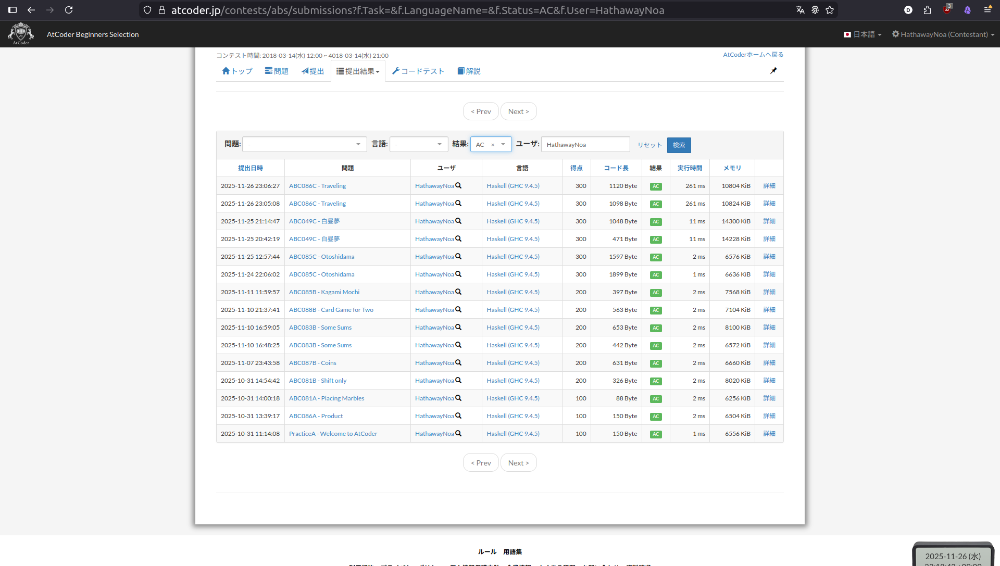

# AtCoder Beginners Selection

## ABOUT

<https://atcoder.jp/contests/abs>

---

## INDEX

- [PracticeA - Welcome to AtCoder](https://atcoder.jp/contests/abs/tasks/practice_1) --> [1.hs](./1.hs)
- [ABC086A - Product](https://atcoder.jp/contests/abs/tasks/abc086_a) --> [2.hs](./2.hs)
- [ABC081A - Placing Marbles](https://atcoder.jp/contests/abs/tasks/abc081_a) --> [3.hs](./3.hs)
- [ABC081B - Shift only](https://atcoder.jp/contests/abs/tasks/abc081_b) --> [4.hs](./4.hs)
- [ABC087B - Coins](https://atcoder.jp/contests/abs/tasks/abc087_b): [5.hs](./5.hs)
- [ABC083B - Some Sums](https://atcoder.jp/contests/abs/tasks/abc083_b): [6.hs](./6.hs)
- [ABC088B - Card Game for Two](https://atcoder.jp/contests/abs/tasks/abc088_b): [7.hs](./7.hs)
- [ABC085B - Kagami Mochi](https://atcoder.jp/contests/abs/tasks/abc085_b): [8.hs](./8.hs)
- [ABC085C - Otoshidama](https://atcoder.jp/contests/abs/tasks/abc085_c): [9_2.hs](./9_2.hs)
- [ABC049C - Daydream](https://atcoder.jp/contests/abs/tasks/abc049_c): [10_2.hs](./10_2.hs)
- [ABC086C - Traveling](https://atcoder.jp/contests/abs/tasks/abc086_c): [11_2.hs](./11_2.hs)
